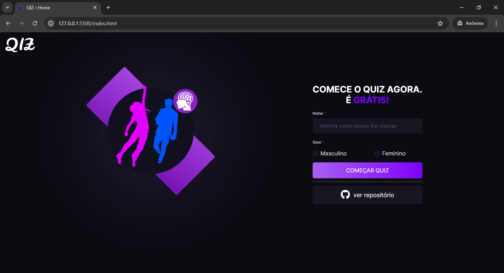
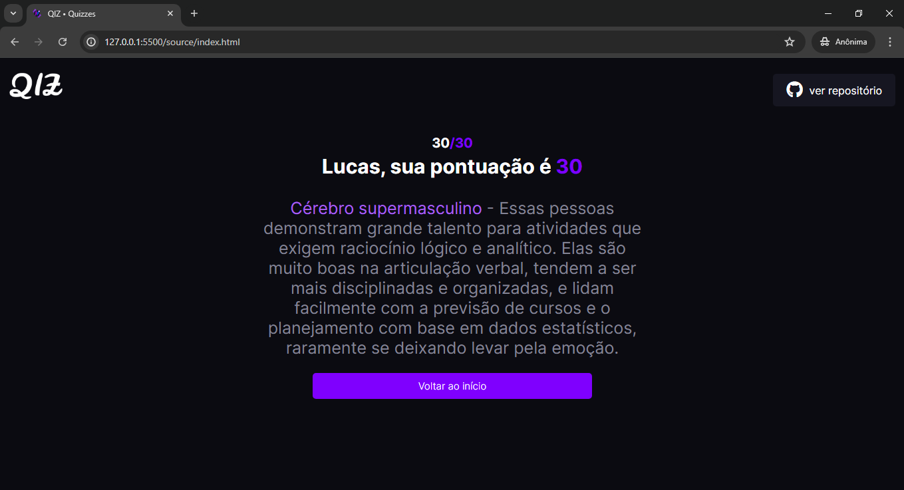

# QIZ • Qual o seu?


Bem-vindo ao **QIZ**, um quiz interativo que avalia o quão feminino ou masculino é o seu modo de pensar. Este projeto foi desenvolvido com HTML, CSS e JavaScript. A inspiração e as perguntas foram retiradas do [vídeo](https://www.youtube.com/watch?v=otOA69fQJBQ&t=759s) postado no canal **Matemática em Evidência**.

## Índice

- [Instalação](#instalação)
- [Uso](#uso)
- [Lógica do Quiz](#lógica-do-quiz)
- [Classificação dos Resultados](#classificação-dos-resultados)
- [Prints do Site](#prints-do-site)
- [Contribuição](#contribuição)
- [Licença](#licença)

## Instalação

Para rodar o projeto localmente, siga os seguintes passos:

1. Clone o repositório:
   ```bash
   git clone https://github.com/euikki/Quiz.git
   ```
2. Navegue até o diretório do projeto:
   ```bash
   cd Quiz
   ```
3. Abra o arquivo `index.html` no seu navegador.

## Uso

1. Na página inicial, insira seu nome e selecione seu gênero.
2. Clique no botão "começar quiz" para iniciar.
3. Responda todas as perguntas apresentadas.
4. Ao finalizar o quiz, veja a sua pontuação e classificação.

## Lógica do Quiz

O quiz coleta as respostas dos usuários e calcula uma pontuação final com base nas regras a seguir:

- **Homem:**
  - Respostas A: multiplicar por 15
  - Respostas B: multiplicar por 5
  - Respostas C: multiplicar por -5

- **Mulher:**
  - Respostas A: multiplicar por 10
  - Respostas B: multiplicar por 5
  - Respostas C: multiplicar por -5

A pontuação final é feita com a soma dos resultados de A, B e C.

## Classificação dos Resultados

### Pontuação

| Intervalo de Pontuação | Classificação |
|------------------------|---------------|
| abaixo de 0            | Cérebro Supermasculino |
| 0 a 149                | Cérebro Supermasculino |
| 150 a 179              | Interseção |
| 180 a 300+              | Cérebro Superfeminino |

### Descrições

- **Cérebro Supermasculino:** Pessoas com grande talento para atividades que exigem raciocínio lógico e analítico. São disciplinadas, organizadas e lidam facilmente com planejamento baseado em dados estatísticos, raramente se deixando levar pela emoção.

- **Interseção:** Pessoas com um pensamento compatível com ambos os sexos, mostrando flexibilidade que é vantajosa para a solução de problemas. Essas pessoas tendem a fazer amigos tanto entre mulheres quanto entre homens.

- **Cérebro Superfeminino:** Pessoas com grande criatividade, talento artístico e musical. A maioria de suas decisões é baseada na intuição e os problemas são resolvidos com inteligência e criatividade.

## Prints do Site
### Página inicial // Home page


### Página do Quiz // Quiz Page


### Quiz Resultado // Quiz result



## Contribuição

Contribuições são bem-vindas! Siga os passos abaixo para contribuir:

1. Faça um fork do projeto.
2. Crie uma nova branch:
   ```bash
   git checkout -b feature/sua-feature
   ```
3. Faça suas alterações e commit:
   ```bash
   git commit -m "feat: descrição das suas alterações"
   ```
4. Envie suas alterações para o repositório remoto:
   ```bash
   git push origin feature/sua-feature
   ```
5. Abra um Pull Request.

## Licença

Este projeto está licenciado sob a licença MIT. Veja o arquivo [LICENSE](LICENSE) para mais detalhes.